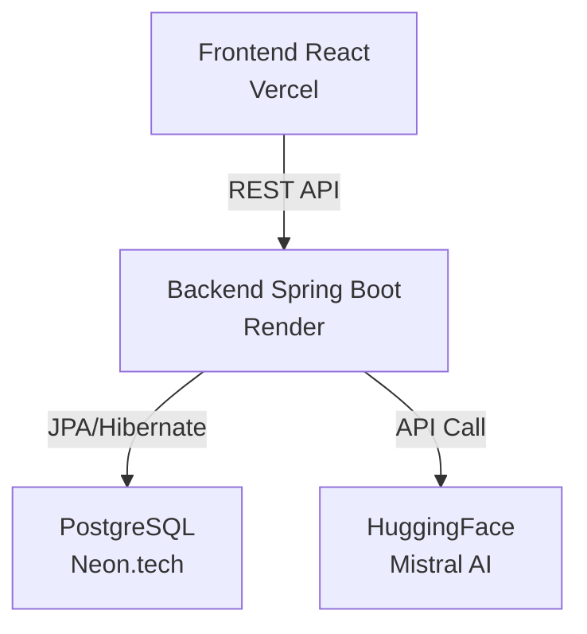

# QuickExpo – AI-powered Academic Presentation Generator

## 🎯 Objectif du projet

**QuickExpo** est une plateforme SaaS qui permet aux élèves, étudiants et enseignants de générer rapidement des exposés et rapports académiques structurés et professionnels (5 minutes ou plus), à partir de paramètres simples.

Le système repose sur :
- une **API backend sécurisée**
- un **moteur de génération IA**
- un **workflow de paiement avant téléchargement**
- une **architecture prête pour la production**

---

## 🧠 Principe de fonctionnement

1. L’utilisateur s’authentifie via **Google ou GitHub**
2. Il crée une commande (`Order`) en fournissant :
   - Thème
   - Sujet
   - Niveau académique
   - Nombre de pages
3. Une **prévisualisation IA** est générée (sans téléchargement)
4. L’utilisateur paie via **Campay**
5. Après paiement :
   - le document final est généré
   - un lien de téléchargement sécurisé est fourni
6. L’utilisateur peut consulter l’**historique de ses documents**

---
## Architecture Global

---

## 🛠️ Technologies & outils

### Backend
- **Java 21**
- **Spring Boot 3.5.9**
- Spring Web
- Spring Data JPA
- Spring Security (OAuth2)
- Spring Validation
- Hibernate ORM
- WebClient (appel IA)

### Base de données
- **PostgreSQL** (hébergée sur **Neon.tech**)
- UUID comme clés primaires

### IA
- **HuggingFace Inference API**
- **Modèle : Mistral**
- Génération de texte académique structuré

### Authentification
- OAuth2 Google
- OAuth2 GitHub
- Enregistrement automatique des utilisateurs

### Paiement
- **Campay** (Mobile Money)
- Callback sécurisé
- Validation avant génération finale

### Documentation
- **Swagger / OpenAPI**

### Déploiement
- Backend : **Render**
- Frontend : **Vercel**
- Base de données : **Neon.tech**

---

## 🧩 Modèle métier principal

### User
- Compte utilisateur authentifié via OAuth2
- Peut créer plusieurs commandes
- Dispose d’un historique personnel

### Order
- Représente une commande de génération de document
- Liée à un seul utilisateur
- Cycle de vie contrôlé :
PENDING → PAID → GENERATING → COMPLETED | FAILED

---

## 🔐 Sécurité

- Authentification obligatoire pour toute action utilisateur
- Accès aux commandes strictement limité au propriétaire
- Téléchargement protégé par token unique
- Aucune génération finale sans paiement

---

## 📁 Organisation du projet

| Package | Description |
|---------|-------------|
| `ai` | Intégration HuggingFace / PromptBuilder |
| `auth` | Gestionnaires OAuth2 (success handlers) |
| `beans` | Entités JPA |
| `dto` | Data Transfer Objects |
| `enums` | Énumérations métier |
| `mapper` | Mappers (Entity ↔ DTO) |
| `repository` | Repositories JPA |
| `service` | Logique métier |
| `controller` | API REST (endpoints) |


> ⚠️ Le frontend React est développé dans une branche séparée :  
> **`develop/front`**

---

## ⚙️ Configuration (application.yaml)

```yaml
spring:
  datasource:
    url: jdbc:postgresql://<NEON_HOST>:5432/<DB_NAME>
    username: <DB_USER>
    password: <DB_PASSWORD>

  jpa:
    hibernate:
      ddl-auto: update
    show-sql: true

  security:
    oauth2:
      client:
        registration:
          google:
            client-id: ${GOOGLE_CLIENT_ID}
            client-secret: ${GOOGLE_CLIENT_SECRET}
          github:
            client-id: ${GITHUB_CLIENT_ID}
            client-secret: ${GITHUB_CLIENT_SECRET}

api:
  ai:
    hugging-face-key: ${HF_API_KEY}
    hugging-face-model: mistralai/Mistral-7B-Instruct-v0.2
```
## 🚀 Lancer le projet en local

### Prérequis

- ☕ **Java 21**
- 📦 **Maven**
- 🗄️ **Compte Neon.tech** (PostgreSQL)
- 🤖 **Compte HuggingFace** (API Key)
- 🔐 **OAuth2 configurés** (Google / GitHub)

### Installation
```bash
mvn clean install
mvn spring-boot:run
```

### Accès

| Service | URL |
|---------|-----|
| **API** | `http://localhost:8080` |
| **Swagger UI** | `http://localhost:8080/swagger-ui.html` |

---

## 📌 État du projet

### ✅ Fonctionnalités implémentées

- ✔️ Authentification OAuth2 (Google, GitHub)
- ✔️ Gestion des utilisateurs
- ✔️ Gestion des commandes
- ✔️ Intégration IA (HuggingFace – Mistral)
- ✔️ Architecture prête pour la production

### 🚧 En cours de développement

- [ ] Génération IA avancée
- [ ] Templates de documents
- [ ] Intégration paiement Campay
- [ ] Frontend React

---

## 👨‍💻 Auteur

Projet conçu et développé dans une optique professionnelle, orientée **SaaS**, avec une **architecture scalable** et un **déploiement cloud-ready**.

---

## 📄 Licence
[MIT]
