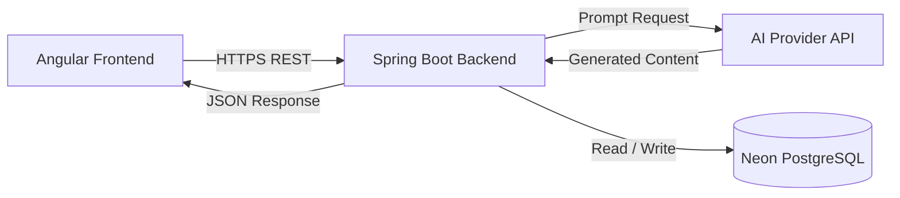
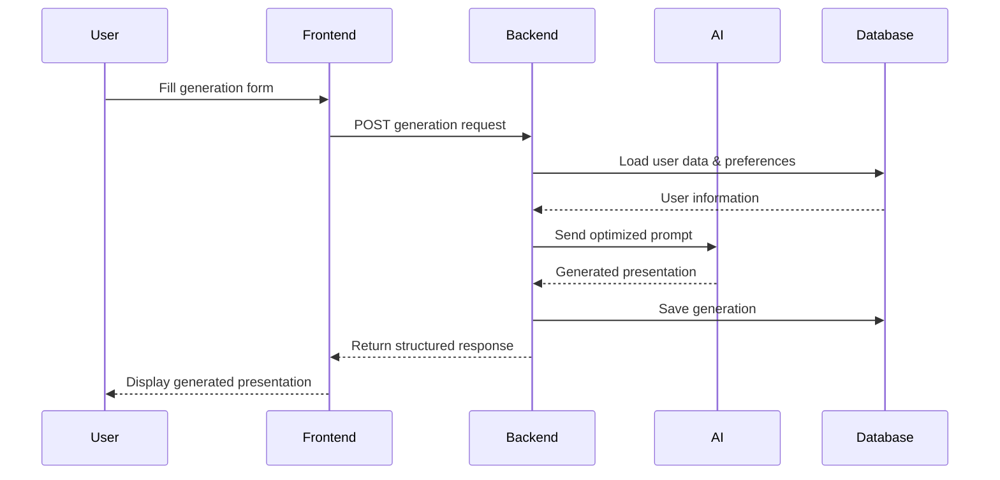
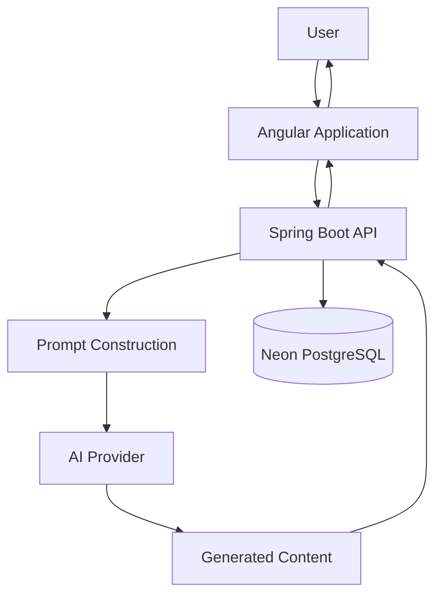

# QuickExpo

<div align="center">

# 🚀 QuickExpo

**AI-powered platform for generating structured academic presentations**

Generate complete, structured, and customizable presentations in just a few minutes using Large Language Models (LLMs).

> **Work in Progress** — The project is currently under active development.


</div>

---

# Table of Contents

- [Overview](#overview)
- [Objectives](#objectives)
- [Key Features](#key-features)
- [System Architecture](#system-architecture)
- [Application Workflow](#application-workflow)
- [Data Flow](#data-flow)
- [Project Structure](#project-structure)
- [Development Roadmap](#development-roadmap)
- [Contributing](#contributing)
- [License](#license)

---

# Overview

QuickExpo is an AI-powered web platform designed to help students, educators, and professionals generate well-structured academic presentations from simple user inputs.

Instead of manually searching for information and organizing ideas, users describe their topic, objectives, audience, and presentation preferences. The platform then generates a complete presentation structure using Large Language Models (LLMs).

QuickExpo focuses on productivity, content quality, and an intuitive user experience while keeping the AI interaction transparent and controllable.

---

# Objectives

QuickExpo aims to:

- Reduce the time required to prepare academic presentations.
- Improve presentation quality through structured AI-generated content.
- Provide customizable outputs adapted to different academic levels.
- Offer a scalable platform for future educational AI services.

---

# Key Features

## AI-assisted generation

- Presentation outline generation
- Structured sections
- Introduction
- Development
- Conclusion
- Bibliography suggestions

---

## Customization

Users can specify:

- Subject
- Academic level
- Language
- Presentation duration
- Writing style
- Audience
- Additional instructions

---

## User Experience

- Modern web interface
- Fast generation
- Secure authentication
- Generation history
- User profile management

---

## Data Persistence

The platform securely stores:

- User accounts
- Generated presentations
- Prompt history
- User preferences
- Metadata

---

# System Architecture

QuickExpo follows a layered architecture separating the presentation layer, business logic, AI integration, and persistence.



---

# Application Workflow



---

# Data Flow



---

# Project Structure

```
QuickExpo/

├── backend/
│
├── frontend/
│
├── docs/
│
├── .github/
│
├── docker/
│
├── README.md
│
└── LICENSE
```

---

# Development Roadmap

## Phase 1

- User authentication
- Presentation generation
- Prompt optimization
- Persistent storage

---

## Phase 2

- Presentation history
- Export capabilities
- Improved customization
- Performance optimization

---

## Phase 3

- Team collaboration
- Shared workspaces
- AI-assisted editing
- Advanced generation options

---

## Phase 4

- Multi-language support
- Academic citation assistance
- Analytics dashboard
- Educational integrations

---

# Contributing

Contributions are welcome.

If you would like to contribute:

1. Fork the repository.
2. Create a feature branch.
3. Commit your changes.
4. Push your branch.
5. Open a Pull Request.

Please ensure that your code follows the project's coding standards and includes appropriate documentation.

---

# License

This project is licensed under the GPL License.

---

<div align="center">

**QuickExpo**

Building the future of AI-assisted academic presentation creation.

</div>
